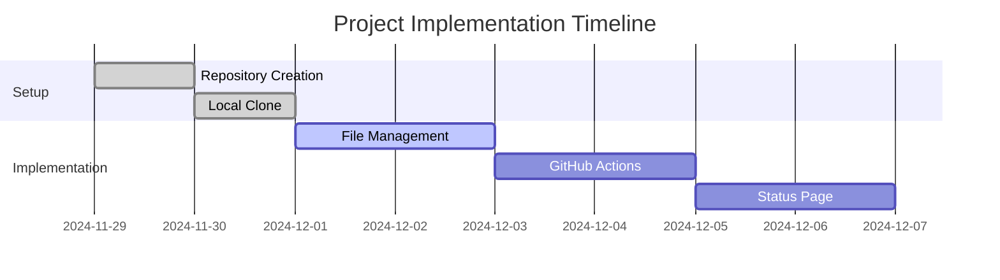

# Status GitHub Project

## Current Status
🟢 Repository Created Successfully

## Project Progress
- [x] Repository creation (2024-11-29)
- [x] Local repository clone
- [ ] File management and updates
- [ ] GitHub Actions setup for gh-pages
- [ ] Status page implementation
- [ ] Documentation updates

## Recent Updates
- 2024-11-29: Repository created successfully
- Issue #1: README.md update through GitHub API failing [Link to issue](https://github.com/patruff/statusGithub/issues/1)

## Project Timeline

## Next Steps
1. Set up GitHub Actions for gh-pages
2. Create initial status page
3. Implement status monitoring

## Issues and PRs
- [Issue #1](https://github.com/patruff/statusGithub/issues/1): README.md update through GitHub API failing