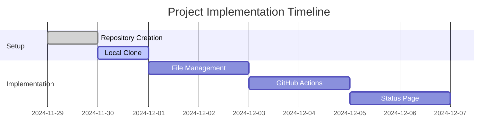

# Status GitHub Project

## Current Status
🟢 Repository Created Successfully

## Project Progress
- [x] Repository creation
- [ ] Local repository clone
- [ ] File management and updates
- [ ] GitHub Actions setup for gh-pages
- [ ] Status page implementation
- [ ] Documentation updates

## Project Timeline


## Recent Updates
- 2024-11-29: Repository created successfully
- Next step: Await local clone confirmation

## Issues and PRs
No active issues or PRs at this time.

## Getting Started
1. Clone the repository:
```bash
git clone https://github.com/patruff/statusGithub.git
```
2. Notify in the issues once cloned successfully
3. We'll proceed with further steps after confirmation

## Project Goals
- Track repository status through README.md
- Implement automated status page using GitHub Pages
- Create comprehensive issue tracking system
- Maintain clear project documentation